<h1 align="center">Raul Beltran</h1>

  <strong>Computer Scientist</strong> · AI Engineer · LLM/Agents Developer · Game Developer

   
  <!--  -->

<!-- 

  
  
  

 -->
<!-- 

  

 -->

## About Me

- Based in Madrid, Spain.
- Computer Scientist from the University of Havana.
- Focused on algorithms, machine learning, and artificial intelligence.
- Interested in number theory, graph theory, and practical AI systems.
- Open to collaborating on meaningful projects.

## Core Stack

### Programming Languages

<a align="left" href="https://portfolio.rb58853.net/skills">
       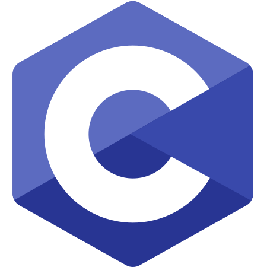  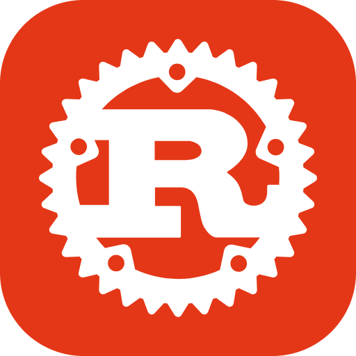     
</a>

### Markup and Documentation

### Platforms and Technologies

<a align="left" href="https://portfolio.rb58853.net/skills">
   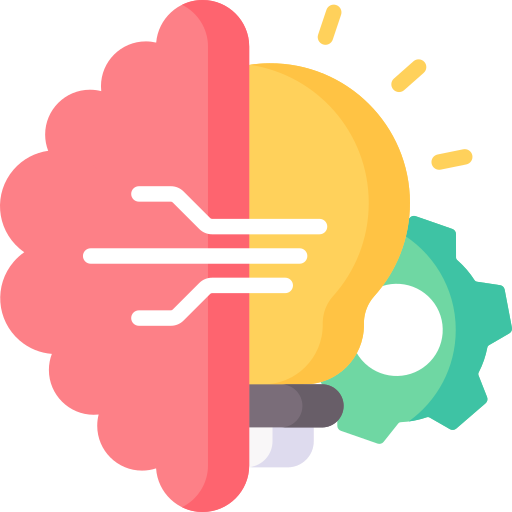 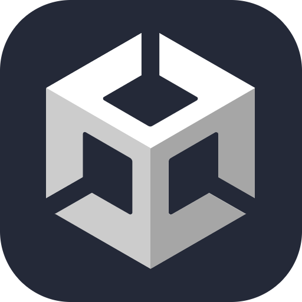   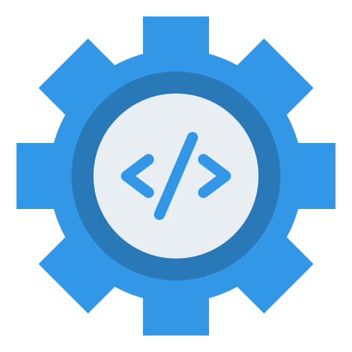      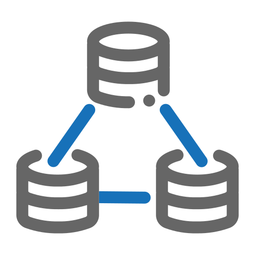  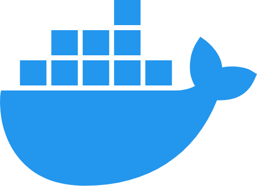
</a>

### Python Ecosystem

<a align="left" href="https://portfolio.rb58853.net/skills">
     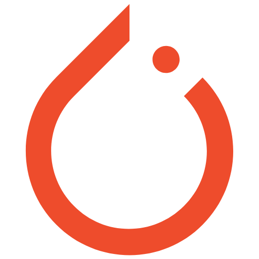 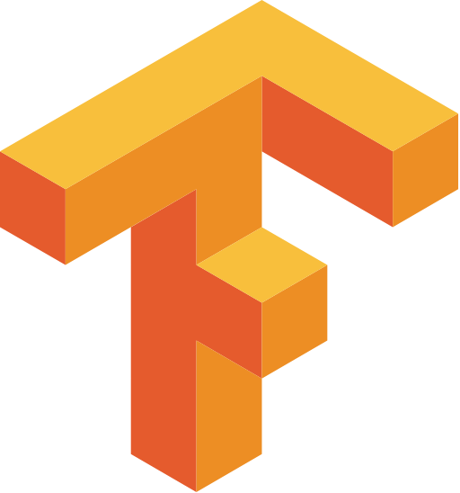 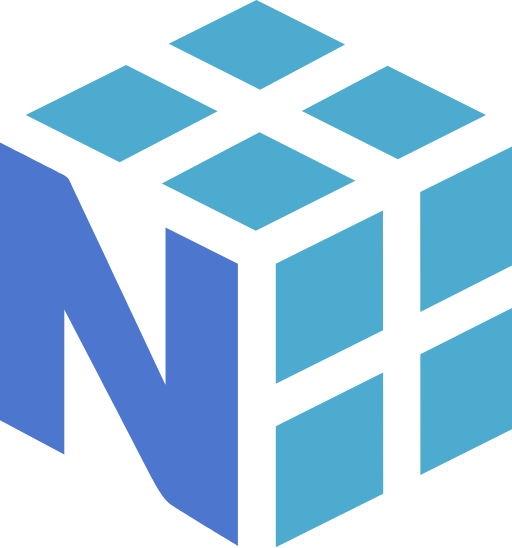 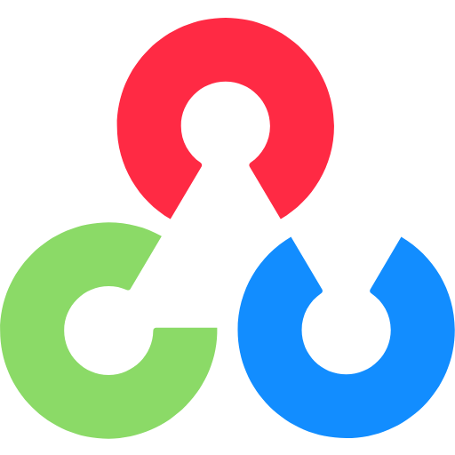  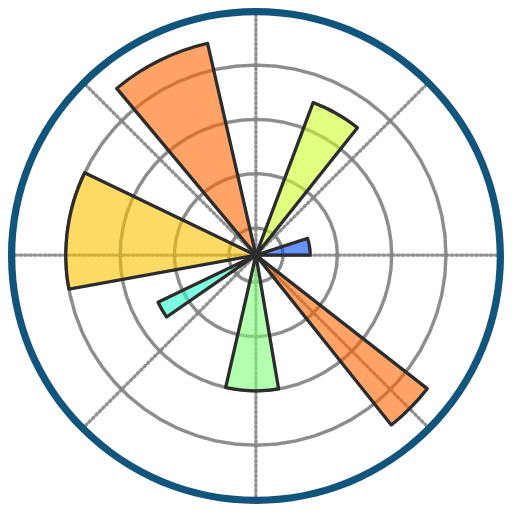 
</a>

### Operating Systems

      

## GitHub Stats

  

  
  

## Featured Projects

| Project | Focus | Stack | Links |
|---|---|---|---|
| fastchat-mcp | Python client for MCP server connections | Python, MCP, HTTPStream | [Repo](https://github.com/rb58853/fastchat-mcp) · [PyPI](https://pypi.org/project/fastchat-mcp) |
| Arcane Ascent | Roguelike card game with multilingual support | Unity, C#, Python | [Steam](https://store.steampowered.com/app/3205630/Arcane_Ascent/) · [Repo](https://github.com/rb58853/Arcane-Ascent) |
| MCP Ecosystem | MCP tools and integrations hub | MCP, OAuth2, LLM | [Repo](https://github.com/rb58853/mcp-ecosystem) |

  
<strong>Research Projects</strong>

### Audio Genre Classification

Machine learning approaches for genre recognition on GTZAN using MFCC, raw signal, and other feature strategies.

- Area: ML / Audio Processing
- Models: CNN, RNN
- Result: competitive performance around 75%-80% accuracy

[Repository](https://github.com/science-engineering-art/mugenfier) · [Paper](https://rb58853.github.io/CV/projects/audioML/audioML.pdf)

### Image Retrieval System with ML

Multimodal retrieval system combining SAM segmentation and CLIP embeddings for precise search on images and text.

- Area: Information Retrieval / Computer Vision
- Keywords: SAM, CLIP, multimodal embeddings

[Repository](https://github.com/rb58853/ML-RSI-Images) · [Paper](https://rb58853.github.io/CV/projects/IRSImagesCLIP/IRSImagesCLIP.pdf)

____

      

