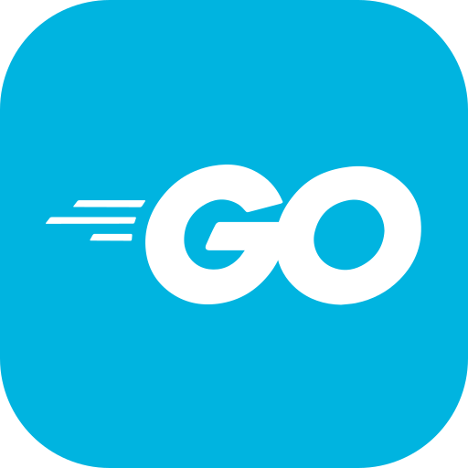

# Hi, my name is Raul Beltran

## Computer Scientist
* 🌍  I'm based in Havana, Cuba.
* 🖥️  See my portfolio [here](https://rb58853.github.io/CV/)
* 🗒️  See my CV [here](https://github.com/rb58853/rb58853/raw/main/assets/cv%20.pdf)
* 🤝🏻  I'm open to collaborating on interesting projects

### About Me
I am Raúl, a computer scientist with a solid background in mathematics. My specialty lies in the analysis and design of algorithms. My experience extends to the application of machine learning techniques and artificial intelligence, with my thesis project being in this field.
My professional interests lean towards number theory, graph theory, and the development of solutions in the field of machine learning and artificial intelligence.

<!-- **Socials**

   
 -->

<h2 align = "center"> Programing Languages</h2>

  
    
    
    
    
    
     
    
     
    
     
     

   

<h3 align="center">Markup Languages</h3>

    
    
    

<h2 align = "center"> Skills</h2>

      
    
  
  
  
  
  
  
  
  
  

<h3 align = "center"> Best frameworks and main libraries for Python3</h3>

    
    
    
    
    
    
    

<h2 align = "center">Operative Systems</h2>

   
   
   

<!-- 

<h3>Some Open Source Projects</h3>

<h3>Projectos Investigativos</h3>

 -->

<h2 align = "center">Github Stats</h2>

<!--  -->

<!--  -->

<!--  -->

-----

 <!--  -->

<!--  -->

<h2 align = "center">Projects</h2>

<!-- 

<kbd>Current On Workig Project</kbd>
 -->
<kbd>
  

  

  ## Arcane
  Arcane es un juego digital innovador que fusiona un sofisticado sistema de combate basado en cartas con mecánicas roguelike tradicionales. El juego implementa tres especializaciones mágicas distintivas: Mago Elemental (dominio de elementos naturales), Mago Invocador (convocatoria de entidades sobrenaturales) y Mago de Sangre (manipulación de esencia vital).

  El sistema técnico está construido sobre Unity con C#, incorporando principios SOLID y metodologías ágiles de desarrollo. Una característica distintiva es su sistema evolutivo de cartas, donde cada especialización cuenta con su propia biblioteca única de cartas mágicas.

  Para garantizar accesibilidad global, Arcane implementa un avanzado sistema de internacionalización que soporta múltiples idiomas, incluyendo español, inglés, chino simplificado/tradicional, japonés, coreano, entre otros. 

  El juego ofrece amplias posibilidades de expansión futura, incluyendo:
  * Nuevos sistemas mágicos y especializaciones
  * Expansión del sistema de progresión
  * Modos multijugador
  * Nuevas mecanicas de juego

  ### Lenguages y Tecnologias
  - **Unity**: Motor Grafico utilizado para generar el juego
  - **C#**: El codigo del proyecto esta programado en c#
  - **Python**: Se utiliza paralelamente para generar idiomas en tiempo de indexacion
  - **OpenAI**: Biblioteca de python utilizada para automatizar la generacion de lenguages con modelos de NLP

  ### Estado actual
  Actualmente esta en modo de desarrollo y es un proyecto de codigo cerrado. En cuando se termine el proyecto se creara un repositorio de codigo abierto con objetivo solamente informativo.
  

</kbd>
<!-- 

 -->