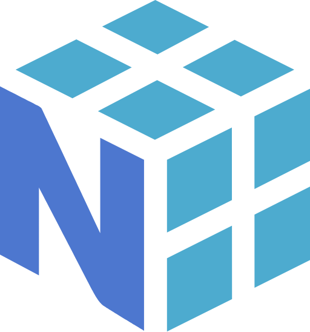

# Hi, my name is Raul Beltran

## Computer Scientist

* 🌍  I'm based in Havana, Cuba.
* 🖥️  See my portfolio [here](https://rb58853.github.io/CV/)
* 🗒️  See my CV [here](https://github.com/rb58853/rb58853/raw/main/assets/cv%20.pdf)
* 🤝🏻  I'm open to collaborating on interesting projects

### About Me

I am Raúl, a computer scientist with a solid background in mathematics. My specialty lies in the analysis and design of algorithms. My experience extends to the application of machine learning techniques and artificial intelligence, with my thesis project being in this field.
My professional interests lean towards number theory, graph theory, and the development of solutions in the field of machine learning and artificial intelligence.

<!-- **Socials**

   
 -->

## Programing Languages

<!-- <h3 align="center">Markup Languages</h3> -->
### Markup Languages

<!-- <h2 align = "center"> Skills</h2> -->
## Skills

<a align= "left" href = "https://rb58853.github.io/CV/#/skills">
  <!--  -->
  
  
  
  
  
  
  
  
  
  
  
</a>

<!-- <h3 align = "center"> Best frameworks and main libraries for Python3</h3> -->
### Best frameworks and main libraries for Python3

<!-- <h2 align = "center">Operative Systems</h2> -->
## Operative Systems

  
  
  
  

<!-- <h2 align = "center">Github Stats</h2> -->
## Github Stats

<!--  -->

<!--  -->

<!--  -->

<!-- <h2 align="center">Some Projects</h2> -->
## Some Projects

    

        
<kbd>Game Dev</kbd>

        <!-- <kbd> -->
        

        

## Arcane Ascent

  Arcane Ascent is an innovative digital game that combines a sophisticated card-based combat system with traditional roguelike mechanics. The game implements three distinctive magical specializations: Elemental Mage (dominion of natural elements), Summoner Mage (convocation of supernatural entities) and Blood Mage (manipulation of vital essence).
  The technical system is built on Unity with C#, incorporating SOLID principles and agile development methodologies. A distinctive feature is its evolutionary card system, where each specialization has its own unique library of magical cards.
  
  To ensure global accessibility, Arcane implements an advanced internationalization system supporting multiple languages, including Spanish, English, Simplified/Traditional Chinese, Japanese, Korean, among others.

  The game offers broad possibilities for future expansion, including:

* New magical systems and specializations
* Expansion of the progression system
* Multiplayer modes
* New gameplay mechanics

### Languages and Technologies

* **Unity**: Graphics engine used to generate the game
* **C#**: Project code is programmed in C#
* **Python**: Used in parallel to generate languages in indexing time
* **OpenAI**: Python library used to automate language generation with NLP models
  <!-- ### Current Status
  Currently in development mode and is a closed-source project. Once the project is completed, an open-source repository will be created with purely informational purposes. -->

----

<a href="" target="_blank">

<!-- </kbd> -->

<kbd>Scientist Projects</kbd>

Audio Genre Classification

## Audio Genre Classification

The classification of music genres plays a crucial role in modern digital audio signal processing applications. In this study, we propose several machine learning approaches to accurately categorize music tracks into predefined genres. Each approach uses different sets of features that can be extracted from songs; ranging from common ones like MFCC (Mel-frequency cepstral coefficients) and direct audio signals to less explored features in this context such as song lyrics and Wavelet Transform. To evaluate the models, we use the GTZAN reference dataset in the field. The results obtained highlight that song lyrics do not contribute much to classification, at least in the dataset used. The other models show results consistent with the state of the art, with an accuracy between 75% and 80%.

### Languages and Technologies

* Machin Learning / Artificial Intelligence | Python
* Models: CNN, RNN
* Keywords: Music genre, CNN, spectrograms, MFCC, Conv1D, encoder

Image Retrieval System using Machine Learning

## Image Retrieval System using Machine Learning

In this project, the problem of precise image retrieval is addressed. The work employs a new approach: the application of the Segment Anything (SAM) segmentation models and the Constractive Language-Image Pretraining (CLIP) model for the generation of multimodal embeddings. Special emphasis is placed on image retrieval via precise queries, taking into account the position of image segments that compose the same, processing both text and images.

### Languages and Technologies

* IRS / ML / AI | Python
* Keywords: Embeddings, Multimodals Embeddings

<a href="https://rb58853.github.io/CV/projects/IRSImagesCLIP/IRSImagesCLIP.pdf">

---

 <!--  -->

<!--  -->

